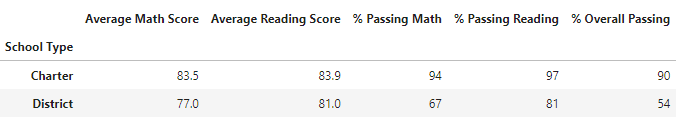

# PyCity School District High School Analysis

## Overview

PyCity School District Board members have tasked the Analytics Department to do assess the pass / fail rate of students in Math and Reading 
    based on several factors such as High School, Grade, and to some extent,  budget per student.
    
## Process and Analysis
    
    The district provided the data for analysis.  It was initially assumed that this data has 
    been correctly collected and there is no large-scale issue with it; however, during the analysis
    it was brought to the attention of the team that there may be irregularities regarding Thomas High 
    School's 9th grade class and hence the testing data for both math and reading  has been struck from
    overall data set.  This will introduce an error in the data at both the Thomas High School level and
    the district level as well.
   
    The data was then sorted along the following:
        
      -District Summary
          -One line summary.  
      -School Summary
          -Aggregated across grade level.  No filtering.
      -High and Low Performing Schools
          -Aggregated across grade level. Top 5 and Bottom 5 schools.
      -Math and Reading Scores by Grade
          -Sorted only by subject Math or Reading.
      -Score by School’s Spending
          -Four distinct per student spending bins.
      -Scores by School Size
          -Three bin sizes.
      -Scores by School Type
          -Two bins.

## Summary Output Results

District Summary

School Summary

High and Low Performing Schools

Low Performing Schools

Math Scores by Grade

Reading Scores by Grade

Score by School’s Spending

Scores by School Size

Scores by School Type

## Summary

In review of the data there are some conclusion that can be immediately seen.  At an elementary level it can be seen that charter schools
with smaller number of students pass more student in the areas of Math and Reading.  Once more they seem to be able to achieve this with an
overall smaller budget in terms of per student spending.

This analysis does not take anything else into account such as parent involment or other at home factors.

Lastly, there are some concerns regarding the nullification of Thomas High School's 9th Grade Class.  Though unlikely this could lead to 
and error as high as (461 / 1635 * 100) = 28.2% for the school's stats though it is more likely roughly in line with the failure rates of
other large district schools.  This will also add a chance of error through the PyCity District of (461 / 39170 * 100) = 1.2% though,
again, the number is likely smaller.

